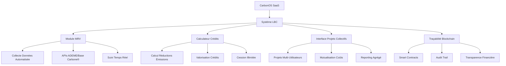

# Architecture LBC pour CarbonOS - Schéma Complet

## Vue d'ensemble de l'intégration LBC



## Composants Techniques LBC Spécifiques

### 1. Module MRV Automatisé

**Fonctionnalités :**
- Collecte automatique des données d'émissions
- Intégration APIs ADEME/Base Carbone®
- Calculs en temps réel des réductions
- Génération automatique des rapports de suivi

**Technologies :**
- APIs REST avec spécifications OpenAPI
- Hooks React pour suivi temps réel
- Service d'export PDF/Excel automatisé
- Base de données PostgreSQL pour audit trail

### 2. Calculateur de Crédits Carbone

**Méthodologie :**
- Quantification des réductions scopes 1, 2, 3
- Calcul d'additionnalité selon référentiel LBC
- Valorisation financière des crédits
- Système de cession illimitée (révision 2025)

**Formules de calcul :**
```
Crédits = (Émissions_Référence - Émissions_Réelles) × Périmètre_Eligible
Additionnalité = min(1, Crédits / Seuil_Minimal)
Valorisation = Crédits × Prix_Marché_Actuel
```

### 3. Interface Projets Collectifs

**Fonctionnalités :**
- Agrégation des données multi-utilisateurs
- Gestion collaborative des projets LBC
- Répartition des crédits entre participants
- Interface de suivi collectif

**Bénéfices :**
- Division des coûts de certification par 10
- Mutualisation des risques
- Effet de levier sur les volumes

### 4. Système de Traçabilité Blockchain

**Architecture :**
- Smart contracts pour chaque crédit carbone
- Audit trail immutable des transactions
- Transparence financière complète
- Intégration avec plateformes de négoce

**Standards :**
- Compatibilité Ethereum/Polygon
- Respect du RGPD pour données personnelles
- Interopérabilité avec autres registres

## Intégration avec l'Écosystème LBC

### APIs ADEME/Base Carbone®

```typescript
// Service d'intégration ADEME
class ADEMEAPI {
  async getEmissionFactors(activity: string): Promise<EmissionFactor[]> {
    // Récupération des facteurs officiels
    const response = await fetch('https://data.ademe.fr/api/records/1.0/search/', {
      method: 'POST',
      headers: { 'Content-Type': 'application/json' },
      body: JSON.stringify({
        dataset: 'base-carbone',
        q: activity,
        rows: 100
      })
    });

    return response.json();
  }

  async calculateEmissions(data: EmissionCalculationRequest): Promise<EmissionResult> {
    // Calcul selon méthodologie ADEME
    const factors = await this.getEmissionFactors(data.activity);
    const result = data.quantity * factors[0].factor;

    return {
      emissions: result,
      factor: factors[0].factor,
      source: 'ADEME Base Carbone®',
      uncertainty: result * 0.1
    };
  }
}
```

### Référentiel CSRD Intégré

**Alignement avec la directive européenne :**
- ESRS E1 : Changement climatique
- ESRS E2 : Pollution
- ESRS E3 : Eau et ressources marines
- ESRS E4 : Biodiversité et écosystèmes
- ESRS E5 : Utilisation des ressources et économie circulaire

**Reporting double :**
- Format LBC pour certification française
- Format CSRD pour conformité européenne
- Génération automatique des deux formats

## Méthodologie LBC Spécifique SaaS

### Champ d'Application

**Périmètre éligible :**
1. **Réductions directes :**
   - Optimisation énergétique des serveurs
   - Hébergement vert certifié
   - Refroidissement écologique des datacenters

2. **Réductions indirectes :**
   - Déplacement évités grâce à la dématérialisation
   - Réduction de la consommation papier
   - Optimisation des processus utilisateurs

3. **Co-bénéfices :**
   - Amélioration de l'accessibilité (réduction consommation)
   - Formation et sensibilisation utilisateurs
   - Innovation technologique bas-carbone

### Calcul d'Additionnalité

**Scénario de référence :**
```
Émissions_Réf = Émissions_Serveurs + Déplacements_Utilisateurs + Papier_Imprimé
```

**Scénario projet :**
```
Émissions_Projet = Émissions_Serveurs_Verts + Déplacements_Évitée + Zéro_Papier
```

**Crédits générés :**
```
Crédits = Émissions_Réf - Émissions_Projet
Additionnalité = Crédits / Seuil_LBC
```

### Système MRV Adapté

**Monitoring :**
- Collecte automatique des métriques serveurs
- Suivi des usages utilisateurs (analytics)
- Mesure des économies papier réelles

**Reporting :**
- Génération automatique des rapports LBC
- Vérification par tiers certificateur
- Audit trail complet et immutable

**Vérification :**
- Contrôle par organisme accrédité (Bureau Veritas)
- Respect du protocole LBC 2025
- Transparence totale des calculs

## Interface Utilisateur LBC

### Dashboard LBC Dédié

**Sections principales :**
1. **Vue d'ensemble des crédits**
   - Crédits générés par période
   - Crédits cédés vs disponibles
   - Valorisation financière

2. **Gestion des projets**
   - Projets individuels actifs
   - Projets collectifs en cours
   - Historique des certifications

3. **Reporting réglementaire**
   - Génération automatique LBC/CSRD
   - Exports PDF/Excel certifiés
   - Interface de soumission

### Outils de Simulation

**Calculateur intégré :**
- Simulation d'impact avant déploiement
- Estimation des crédits potentiels
- Analyse de sensibilité des paramètres

**Optimiseur de stratégie :**
- Comparaison scénarios LBC
- Recommandations d'optimisation
- Calcul ROI carbone

## Partenariats Stratégiques

### Organismes Certificateurs

**Bureau Veritas :**
- Vérification spécialisée SaaS
- Audit des calculs carbone
- Certification des réductions

**Autres partenaires :**
- ADEME : Support méthodologique
- DGEC : Accompagnement réglementaire
- Chambres d'agriculture : Projets collectifs

### Plateformes de Négoce

**Intégration avec :**
- GéoCarbone : Plateforme de cession
- Autres registres carbone européens
- Places de marché spécialisées

## Calendrier de Mise en Œuvre

### Phase 1 : Fondations (Mois 1-3)

**Semaine 1-4 :**
- Audit carbone initial de CarbonOS
- Analyse des méthodes LBC applicables
- Identification des leviers de réduction

**Semaine 5-8 :**
- Développement de la méthodologie personnalisée
- Intégration des APIs ADEME
- Tests des calculs automatisés

**Semaine 9-12 :**
- Développement du module MRV
- Interface de gestion des projets
- Tests d'intégration

### Phase 2 : Certification (Mois 4-6)

**Mois 4 :**
- Soumission de la méthodologie à la DGEC
- Développement collaboratif avec l'ADEME
- Préparation du dossier projet pilote

**Mois 5 :**
- Sélection de l'organisme vérificateur
- Audit initial du système MRV
- Ajustements selon recommandations

**Mois 6 :**
- Soumission du dossier de labellisation
- Préparation de la communication
- Formation des équipes

### Phase 3 : Exploitation (Mois 7-12)

**Mois 7-8 :**
- Réception du label LBC
- Lancement commercial des fonctionnalités
- Communication et marketing

**Mois 9-12 :**
- Suivi et optimisation des réductions
- Génération des premiers crédits
- Préparation des rapports annuels

## Indicateurs de Succès

### Métriques Techniques

**Conformité LBC :**
- Méthodologie approuvée par la DGEC
- Système MRV certifié ISO 14064
- Taux de vérification >95%

**Performance Environnementale :**
- Réductions d'émissions >500 tCO2/an
- Crédits générés valorisables
- Co-bénéfices quantifiés et démontrés

### Métriques Économiques

**ROI Carbone :**
- Coût de certification amorti en <2 ans
- Revenus crédits > coût plateforme
- Taux de pénétration marché >15%

**Impact Utilisateur :**
- Nombre d'utilisateurs bénéficiant du label
- Projets collectifs initiés
- Réductions d'émissions indirectes

## Conclusion

L'alignement de CarbonOS avec le Label Bas Carbone représente une opportunité stratégique majeure pour positionner la plateforme comme leader de la transition numérique bas-carbone en France. En tirant parti de ses atouts technologiques (automatisation, accessibilité, APIs avancées) et en développant une méthodologie spécifique aux SaaS, CarbonOS peut générer des crédits carbone substantiels tout en offrant une différenciation commerciale significative.

Le succès reposera sur une exécution rigoureuse de la feuille de route, des partenariats solides avec les organismes officiels, et une démonstration claire de l'additionnalité des réductions générées par la plateforme.