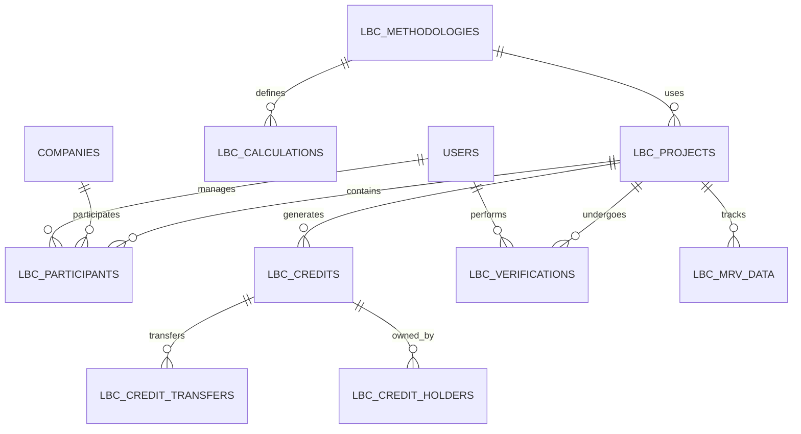

# Schéma de Base de Données LBC pour CarbonOS

## Vue d'ensemble du modèle de données



## Tables principales LBC

### lbc_projects (Projets Labellisés)

```sql
CREATE TABLE lbc_projects (
  id SERIAL PRIMARY KEY,
  project_id VARCHAR(50) UNIQUE NOT NULL, -- Identifiant LBC officiel
  name VARCHAR(255) NOT NULL,
  description TEXT,
  project_type VARCHAR(50) NOT NULL, -- 'individual', 'collective'
  methodology_id INTEGER REFERENCES lbc_methodologies(id),

  -- Localisation
  region VARCHAR(100),
  department VARCHAR(100),
  coordinates POINT, -- PostGIS pour géolocalisation

  -- Périmètre
  start_date DATE NOT NULL,
  end_date DATE,
  total_credits_expected DECIMAL(15,3),
  credits_generated DECIMAL(15,3) DEFAULT 0,

  -- Statut
  status VARCHAR(50) DEFAULT 'draft', -- draft, submitted, approved, active, completed
  submission_date TIMESTAMP,
  approval_date TIMESTAMP,

  -- Métadonnées
  created_by INTEGER REFERENCES users(id),
  created_at TIMESTAMP DEFAULT NOW(),
  updated_at TIMESTAMP DEFAULT NOW()
);
```

### lbc_methodologies (Méthodologies Approuvées)

```sql
CREATE TABLE lbc_methodologies (
  id SERIAL PRIMARY KEY,
  methodology_code VARCHAR(50) UNIQUE NOT NULL,
  name VARCHAR(255) NOT NULL,
  version VARCHAR(20) NOT NULL,
  sector VARCHAR(100) NOT NULL,

  -- Contenu méthodologique
  eligibility_criteria JSONB,
  calculation_formula JSONB,
  mrv_requirements JSONB,

  -- Approbation
  approval_date DATE,
  approved_by VARCHAR(255),
  valid_until DATE,

  -- Métadonnées
  created_at TIMESTAMP DEFAULT NOW()
);
```

### lbc_credits (Crédits Carbone Générés)

```sql
CREATE TABLE lbc_credits (
  id SERIAL PRIMARY KEY,
  credit_id VARCHAR(100) UNIQUE NOT NULL,
  project_id INTEGER REFERENCES lbc_projects(id),

  -- Caractéristiques du crédit
  vintage_year INTEGER NOT NULL, -- Année de génération
  quantity_tco2 DECIMAL(15,3) NOT NULL,
  credit_type VARCHAR(50) DEFAULT 'standard', -- standard, early_action

  -- Statut et propriété
  status VARCHAR(50) DEFAULT 'issued', -- issued, transferred, retired, cancelled
  current_owner_id INTEGER REFERENCES lbc_credit_holders(id),
  original_owner_id INTEGER REFERENCES lbc_credit_holders(id),

  -- Blockchain
  blockchain_tx_hash VARCHAR(255),
  smart_contract_address VARCHAR(255),

  -- Métadonnées
  issued_date TIMESTAMP DEFAULT NOW(),
  created_at TIMESTAMP DEFAULT NOW()
);
```

### lbc_credit_transfers (Transferts de Crédits)

```sql
CREATE TABLE lbc_credit_transfers (
  id SERIAL PRIMARY KEY,
  transfer_id VARCHAR(100) UNIQUE NOT NULL,
  credit_id INTEGER REFERENCES lbc_credits(id),

  -- Parties
  from_holder_id INTEGER REFERENCES lbc_credit_holders(id),
  to_holder_id INTEGER REFERENCES lbc_credit_holders(id),

  -- Détails de la transaction
  quantity_tco2 DECIMAL(15,3) NOT NULL,
  transfer_date TIMESTAMP DEFAULT NOW(),
  price_per_tco2 DECIMAL(10,2), -- Prix unitaire si vente

  -- Blockchain
  tx_hash VARCHAR(255),
  platform VARCHAR(100), -- Plateforme de négoce utilisée

  -- Métadonnées
  created_at TIMESTAMP DEFAULT NOW()
);
```

### lbc_credit_holders (Détenteurs de Crédits)

```sql
CREATE TABLE lbc_credit_holders (
  id SERIAL PRIMARY KEY,
  holder_type VARCHAR(50) NOT NULL, -- 'company', 'individual', 'platform'
  holder_id INTEGER, -- Référence vers companies ou users

  -- Informations spécifiques LBC
  registration_number VARCHAR(100), -- N° registre LBC
  kyc_status VARCHAR(50) DEFAULT 'pending', -- pending, approved, rejected

  -- Coordonnées
  company_name VARCHAR(255),
  contact_email VARCHAR(255),
  contact_phone VARCHAR(50),

  -- Métadonnées
  created_at TIMESTAMP DEFAULT NOW(),
  updated_at TIMESTAMP DEFAULT NOW()
);
```

### lbc_mrv_data (Données MRV)

```sql
CREATE TABLE lbc_mrv_data (
  id SERIAL PRIMARY KEY,
  project_id INTEGER REFERENCES lbc_projects(id),

  -- Période de reporting
  reporting_period VARCHAR(50) NOT NULL, -- '2023', '2023-Q4', etc.
  start_date DATE NOT NULL,
  end_date DATE NOT NULL,

  -- Données collectées
  emissions_reductions DECIMAL(15,3) NOT NULL,
  calculation_details JSONB,

  -- Vérification
  verification_status VARCHAR(50) DEFAULT 'pending',
  verified_by INTEGER REFERENCES users(id),
  verification_date TIMESTAMP,

  -- Documents
  supporting_documents JSONB, -- Liste des fichiers justificatifs

  -- Métadonnées
  submitted_by INTEGER REFERENCES users(id),
  submitted_at TIMESTAMP DEFAULT NOW(),
  created_at TIMESTAMP DEFAULT NOW()
);
```

### lbc_verifications (Vérifications)

```sql
CREATE TABLE lbc_verifications (
  id SERIAL PRIMARY KEY,
  verification_id VARCHAR(100) UNIQUE NOT NULL,
  project_id INTEGER REFERENCES lbc_projects(id),

  -- Informations du vérificateur
  verifier_organization VARCHAR(255) NOT NULL,
  verifier_contact VARCHAR(255),
  accreditation_number VARCHAR(100),

  -- Périmètre de vérification
  verification_scope TEXT,
  verification_period_start DATE,
  verification_period_end DATE,

  -- Résultats
  verification_result VARCHAR(50), -- positive, negative, qualified
  verified_credits DECIMAL(15,3),
  verification_report_url VARCHAR(500),

  -- Dates
  verification_date TIMESTAMP,
  valid_until DATE,

  -- Métadonnées
  created_at TIMESTAMP DEFAULT NOW()
);
```

### lbc_calculations (Calculs Détaillés)

```sql
CREATE TABLE lbc_calculations (
  id SERIAL PRIMARY KEY,
  project_id INTEGER REFERENCES lbc_projects(id),
  methodology_id INTEGER REFERENCES lbc_methodologies(id),

  -- Paramètres de calcul
  calculation_type VARCHAR(100) NOT NULL,
  input_parameters JSONB NOT NULL,
  calculation_results JSONB NOT NULL,

  -- Référence et additionnalité
  baseline_scenario JSONB,
  project_scenario JSONB,
  additionality_demonstrated BOOLEAN DEFAULT FALSE,

  -- Audit
  calculation_date TIMESTAMP DEFAULT NOW(),
  calculated_by INTEGER REFERENCES users(id),

  -- Métadonnées
  created_at TIMESTAMP DEFAULT NOW()
);
```

## Tables d'intégration avec CarbonOS existant

### Extension de la table companies

```sql
ALTER TABLE companies ADD COLUMN IF NOT EXISTS lbc_eligible BOOLEAN DEFAULT FALSE;
ALTER TABLE companies ADD COLUMN IF NOT EXISTS lbc_registration_number VARCHAR(100);
ALTER TABLE companies ADD COLUMN IF NOT EXISTS carbon_impact_score DECIMAL(5,2);
ALTER TABLE companies ADD COLUMN IF NOT EXISTS green_hosting_certified BOOLEAN DEFAULT FALSE;
```

### Extension de la table emission_data

```sql
ALTER TABLE emission_data ADD COLUMN IF NOT EXISTS lbc_project_id INTEGER REFERENCES lbc_projects(id);
ALTER TABLE emission_data ADD COLUMN IF NOT EXISTS lbc_credits_generated DECIMAL(15,3);
ALTER TABLE emission_data ADD COLUMN IF NOT EXISTS mrv_verified BOOLEAN DEFAULT FALSE;
ALTER TABLE emission_data ADD COLUMN IF NOT EXISTS verification_body VARCHAR(255);
```

## Indexes de performance

```sql
-- Index pour les requêtes principales
CREATE INDEX idx_lbc_projects_status ON lbc_projects(status);
CREATE INDEX idx_lbc_projects_type ON lbc_projects(project_type);
CREATE INDEX idx_lbc_credits_status ON lbc_credits(status);
CREATE INDEX idx_lbc_credits_vintage ON lbc_credits(vintage_year);
CREATE INDEX idx_lbc_mrv_project_period ON lbc_mrv_data(project_id, reporting_period);

-- Index géographiques
CREATE INDEX idx_lbc_projects_location ON lbc_projects USING GIST(coordinates);
CREATE INDEX idx_lbc_projects_region ON lbc_projects(region, department);

-- Index pour les calculs de performance
CREATE INDEX idx_lbc_calculations_project ON lbc_calculations(project_id);
CREATE INDEX idx_lbc_calculations_date ON lbc_calculations(calculation_date);
```

## Vues matérialisées pour les rapports

### Vue des crédits par projet

```sql
CREATE MATERIALIZED VIEW lbc_credits_by_project AS
SELECT
  p.id as project_id,
  p.name as project_name,
  p.project_type,
  COUNT(c.id) as total_credits,
  SUM(c.quantity_tco2) as total_volume_tco2,
  AVG(c.quantity_tco2) as avg_credit_size,
  MIN(c.vintage_year) as first_vintage,
  MAX(c.vintage_year) as last_vintage
FROM lbc_projects p
LEFT JOIN lbc_credits c ON p.id = c.project_id
WHERE c.status = 'issued'
GROUP BY p.id, p.name, p.project_type;
```

### Vue des performances par secteur

```sql
CREATE MATERIALIZED VIEW lbc_performance_by_sector AS
SELECT
  p.sector,
  p.region,
  COUNT(DISTINCT p.id) as project_count,
  SUM(c.quantity_tco2) as total_credits,
  AVG(c.quantity_tco2) as avg_credit_size,
  COUNT(DISTINCT ch.company_name) as unique_holders
FROM lbc_projects p
LEFT JOIN lbc_credits c ON p.id = c.project_id
LEFT JOIN lbc_credit_holders ch ON c.current_owner_id = ch.id
WHERE c.status = 'issued'
GROUP BY p.sector, p.region;
```

## Triggers pour l'automatisation

### Trigger de calcul automatique des crédits

```sql
CREATE OR REPLACE FUNCTION calculate_lbc_credits()
RETURNS TRIGGER AS $$
BEGIN
  -- Calcul automatique lors de la validation des données MRV
  IF NEW.verification_status = 'verified' AND OLD.verification_status != 'verified' THEN
    INSERT INTO lbc_credits (
      project_id,
      vintage_year,
      quantity_tco2,
      issued_date
    ) VALUES (
      NEW.project_id,
      EXTRACT(YEAR FROM NEW.end_date),
      NEW.emissions_reductions,
      NOW()
    );
  END IF;

  RETURN NEW;
END;
$$ LANGUAGE plpgsql;

CREATE TRIGGER trigger_calculate_credits
  AFTER UPDATE ON lbc_mrv_data
  FOR EACH ROW
  EXECUTE FUNCTION calculate_lbc_credits();
```

### Trigger de mise à jour des timestamps

```sql
CREATE OR REPLACE FUNCTION update_updated_at_column()
RETURNS TRIGGER AS $$
BEGIN
  NEW.updated_at = NOW();
  RETURN NEW;
END;
$$ LANGUAGE plpgsql;

CREATE TRIGGER trigger_lbc_projects_updated_at
  BEFORE UPDATE ON lbc_projects
  FOR EACH ROW
  EXECUTE FUNCTION update_updated_at_column();
```

## Sécurité et conformité RGPD

### Masquage des données personnelles

```sql
-- Vue pour les données anonymisées (usage public)
CREATE VIEW lbc_public_projects AS
SELECT
  id,
  project_id,
  name,
  project_type,
  region,
  total_credits_expected,
  status,
  created_at
FROM lbc_projects
WHERE status = 'active';
```

### Audit trail complet

```sql
-- Table pour tracer toutes les modifications
CREATE TABLE lbc_audit_log (
  id SERIAL PRIMARY KEY,
  table_name VARCHAR(100) NOT NULL,
  record_id INTEGER NOT NULL,
  operation VARCHAR(10) NOT NULL, -- INSERT, UPDATE, DELETE
  old_values JSONB,
  new_values JSONB,
  changed_by INTEGER REFERENCES users(id),
  changed_at TIMESTAMP DEFAULT NOW()
);

-- Fonction générique d'audit
CREATE OR REPLACE FUNCTION audit_trigger_function()
RETURNS TRIGGER AS $$
BEGIN
  IF TG_OP = 'INSERT' THEN
    INSERT INTO lbc_audit_log (table_name, record_id, operation, new_values, changed_by)
    VALUES (TG_TABLE_NAME, NEW.id, TG_OP, row_to_json(NEW), NEW.created_by);
    RETURN NEW;
  ELSIF TG_OP = 'UPDATE' THEN
    INSERT INTO lbc_audit_log (table_name, record_id, operation, old_values, new_values, changed_by)
    VALUES (TG_TABLE_NAME, NEW.id, TG_OP, row_to_json(OLD), row_to_json(NEW), NEW.updated_by);
    RETURN NEW;
  ELSIF TG_OP = 'DELETE' THEN
    INSERT INTO lbc_audit_log (table_name, record_id, operation, old_values, changed_by)
    VALUES (TG_TABLE_NAME, OLD.id, TG_OP, row_to_json(OLD), OLD.updated_by);
    RETURN OLD;
  END IF;
  RETURN NULL;
END;
$$ LANGUAGE plpgsql;
```

## Intégration avec les APIs externes

### Table de synchronisation ADEME

```sql
CREATE TABLE ademe_sync_log (
  id SERIAL PRIMARY KEY,
  sync_type VARCHAR(50) NOT NULL, -- 'factors', 'benchmarks', 'regulations'
  last_sync TIMESTAMP,
  records_synced INTEGER DEFAULT 0,
  status VARCHAR(50) DEFAULT 'success',
  error_message TEXT,
  created_at TIMESTAMP DEFAULT NOW()
);
```

### Cache des facteurs d'émission

```sql
CREATE TABLE emission_factors_cache (
  id SERIAL PRIMARY KEY,
  factor_code VARCHAR(100) UNIQUE NOT NULL,
  source VARCHAR(50) NOT NULL, -- 'ademe', 'base_carbone', 'custom'
  data JSONB NOT NULL,
  last_updated TIMESTAMP DEFAULT NOW(),
  expires_at TIMESTAMP
);

CREATE INDEX idx_emission_factors_source ON emission_factors_cache(source);
CREATE INDEX idx_emission_factors_updated ON emission_factors_cache(last_updated);
```

## Conclusion

Ce schéma de base de données LBC pour CarbonOS fournit une infrastructure complète et évolutive pour :

1. **Gestion complète des projets LBC** avec suivi détaillé
2. **Calcul et traçabilité des crédits carbone** selon le nouveau cadre 2025
3. **Système MRV automatisé** avec audit trail complet
4. **Intégration transparente** avec l'écosystème existant de CarbonOS
5. **Conformité RGPD** avec masquage et audit des données personnelles
6. **Performance optimisée** avec vues matérialisées et index stratégiques

L'architecture supporte à la fois les projets individuels et collectifs, avec une traçabilité blockchain pour la cession illimitée des crédits, tout en maintenant la compatibilité avec les standards européens CSRD.